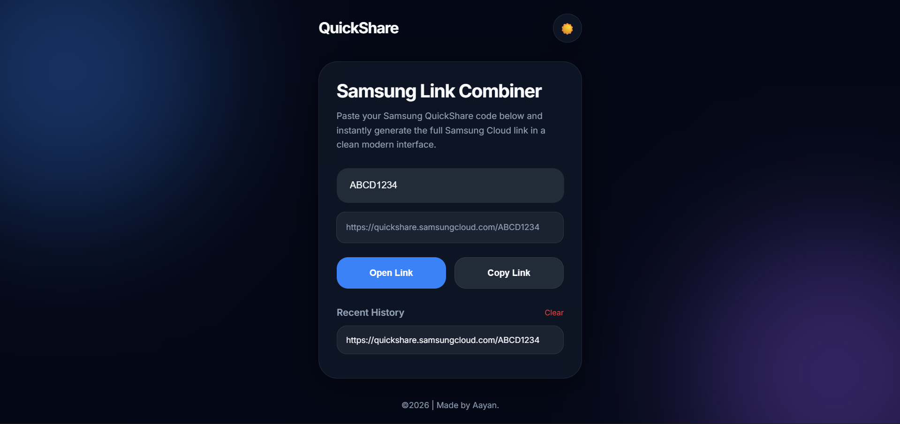

# Samsung Quick Share Link Combiner

A simple and lightweight web tool that helps users quickly open Samsung Quick Share links using only the share code.

Instead of manually typing the full Samsung Quick Share URL, users can enter the code to instantly generate, open, copy, or share the link. The website will also supports QR code generation for easier sharing between phones and PCs in future.

---

## Features

- Generate Samsung Quick Share links instantly
- Open links directly in the browser
- Copy generated links with one click
- Mobile-friendly responsive design
- Lightweight and fast
- No installation required
- Dark/Light mode toggle

---
## How It Works

Samsung Quick Share links use the following format:
```
https://quickshare.samsungcloud.com/XXXXXXXX
```
This tool automatically combines the base URL with the share code entered by the user.
```
Example:
Code: ABC123

Generated Link:
https://quickshare.samsungcloud.com/ABC123
```
### Why This Exists:

Opening Quick Share links on PCs can sometimes be inconvenient, especially when scanning QR codes using low-quality webcams.

### This tool makes the process faster and easier by allowing users to:

- Type only the code
- Instantly open the link

### Technologies Used:

- HTML
- CSS
- JavaScript

### Future Improvements:

- QR code download support
- Share button
- PWA support
- Camera QR scanner

## Live Demo

https://singhaayan-03.github.io/samsung-quickshare-link-combiner/

## Disclaimer

This project is an unofficial helper tool and is not affiliated with Samsung.

## Preview

<p align="center">
  
</p>
